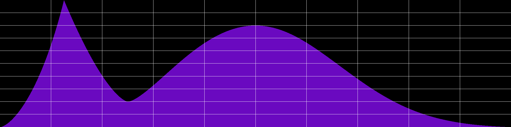

# Hypercurve Documentation



## What is it?

Hypercurve is a library that allows you to combine several curve algorithms into a single 2D envelope. It is designed to be used in audio applications, for those who appreciate a finely shaped curve. 
As shown above, you can perfectly combine Gaussian curves with Diocles cissoid curves and many other curve algorithms. 
The library can be used in C++, Lua, Csound, and Faust.

Every curve algorithm is different. In audio applications, we use envelopes to control any kind of parameter. In computer music, the way a value changes over time has a significant influence on how we perceive sound. Thus, the ability to create finely shaped envelopes is essential. This is the purpose of Hypercurve.

The above hypercurve is a combination of 1/8 Diocles curve, 1/8 Toxoid curve, 2/8 Mouth curve, and 4/8 Gaussian curve.

## Implemented Curve Algorithms

- Cissoid (Diocles curve) 
- Cubic 
- Power curve (choose your power of x)
- Bezier (Cubic & Quadratic)
- Cubic Spline - Not implemented in Csound yet
- Catmull-Rom Spline
- Hanning / Hamming / Blackman
- Gaussian 
- Toxoid (aka duplicatrix_cubic)
- Catenary (aka funicular)
- Tightrope Walker curve  
- Mouth curve
- Bicorn curve
- Easing curves - from [easings.net](https://github.com/ai/easings.net) - translated to C++
- Typed curves: inspired by Csound's [GEN16](http://www.csounds.com/manual/html/GEN16.html)
- User-defined curves: pass it a function (or a lambda in C++), that returns y for any x between 0 and 1. Not implemented in Csound.

## How to Install and Use It

Go to [Releases](https://github.com/johannphilippe/hypercurve/releases) and download the latest version.

### Csound Install

To install HYPERCURVE opcodes for Csound, move the `csound_hypercurve` library to the plugins repository of Csound.

* **Windows:** Move `csound_hypercurve.dll` to `C:/Program Files/Csound6_x64/plugins64/`.
* **MacOS:** Move `libcsound_hypercurve.dylib` to `/Library/Frameworks/CsoundLib64.framework/Versions/6.0/Resources/Opcodes64`.
* **Linux (Debian):** Move `libcsound_hypercurve.so` to `/usr/local/lib/csound/plugins64/`.

### Lua Use

On any OS where Hypercurve is compiled, you can write a Lua script using Hypercurve in the Hypercurve directory and execute it from the terminal with `./luajit myscript.lua`. Replace `myscript.lua` with the name of your script.
On Windows, use `./luajit.exe myscript.lua`.


## How to Use It

There are four ways to use it: in C++, Csound, Faust, or Lua. CMake will help you build libraries that can be used in those languages. You will find C++ examples under `hypercurve_test/test.cpp`, Csound examples under `csound_opcode/test.csd`, and Lua examples under `lua_module/test.lua`. 

The basic syntax is as follows: 
* `hypercurve(integer size, double y_start, {segment_list});`
  - `size`: The size in samples
  - `y_start`: The starting point of the curve
  - `segment_list`: A list of segments

* `segment(double frac, double y_destination, curve_type crv);`
  - `frac`: The fractional size of the segment (fraction between 0 and 1)
  - `y_destination`: The target point
  - `crv`: A curve algorithm picked from Hypercurve

## A Simple C++ Example

```c++
#include "hypercurve.h"
using namespace hypercurve;

const int definition = 16384;
double y_start = 0;

curve c(definition, y_start, 
{
    // segment(fractional_size, y_destination, curve)
    segment(fraction(1, 2), 1.0, share(cissoid_curve(1))),
    segment(0.5, 0.0, share(blackman_curve()))
});

// Then access samples with double *get_samples() 
c.get_samples();
```

## A Simple Csound Example

```csound
instr 1
    icrv = hc_hypercurve(2048, 0, 
                hc_segment(1/2, 1, hc_diocles_curve(1)),
                hc_segment(1/2, 0, hc_hanning_curve()))
    kenv = tablei:k(linseg:k(0, p3, 1), icrv, 1)
    ao = vco2(0.3, 300) * kenv
    outs(ao, ao)
endin
```

## A Simple Lua Example

```lua
package.cpath = package.cpath .. ";/your/path/to/hypercurve/?.so;"
local hc = require("liblua_hypercurve")
local definition = 16384
local y_start = 0

local crv = hc.hypercurve(definition, y_start, 
{
    hc.segment(1/2, 1.0, hc.cissoid_curve(1.0)),
    hc.segment(1/2, 0.0, hc.cubic_curve(0.0))
})

-- Write as 24 bits 48KHz wav
hc.write_as_wav("path/to/outfile.wav", crv)
```

## A Simple Faust Example

```faust
hc = library("hypercurve.lib");
definition = 16384;
y_start = 0;

curve = hc.hypercurve(definition, y_start, (
    hc.segment(1/2, 1.0, hc.cissoid_curve(1.0)),
    hc.segment(1/2, 0.0, hc.cubic_curve)
));

// Run with interpolation
env = hc.runi(curve, os.phasor(1, 1));
```


# Build

First, clone the repo with submodules:

```bash
git clone https://github.com/johannphilippe/hypercurve.git --recurse-submodules
```

Ensure that Lua is installed on your system. If not, or if compilation returns errors, install a Lua 5.1 version in the standard installation path. Make sure you have the dynamic library installed, and the headers `lauxlib.h` and `lua.h` are available on your system.

```bash
cd hypercurve
mkdir build && cd build
cmake .. -DBUILD_ALL=TRUE
make
```

If you only want to build for a specific language, use:

```bash
cmake .. -DBUILD_CSOUND_OPCODE=TRUE
cmake .. -DBUILD_LUA_MODULE=TRUE
cmake .. -DBUILD_FAUST_LIB=TRUE
```

On some platforms (e.g., Windows), you may need to set the Lua paths with the following options:

```bash
cmake .. -DBUILD_LUA_MODULE=TRUE -DLUA_INCLUDE_DIR=/your/dir/include -DLUA_LIBRARIES=/path/to/lua.lib
```

For Windows builds, ensure that the `.lib` and `.dll` libraries of Lua share the same name and path. This will allow CMake to copy the Lua `.dll` dynamic library next to `lua_hypercurve` in the bin folder.

To build the Faust library, you will need [Quom](https://pypi.org/project/quom/) installed on your system. See the Faust [README](faust_lib/README.md).

The PNG writer [fpng](https://github.com/richgel999/fpng) used for hypercurve has SSE support. This can be enabled with `-DSSE=1`.

The resulting binaries will be located in the `bin` directory. On Windows, `lua_hypercurve.dll` and `hypercurve.dll` require `sndfile.dll` in the same folder. `lua_hypercurve.dll` also requires the Lua `.dll` you linked against (e.g., `lua5.1.dll`). This must be considered when packaging the library for use in other applications.

## WASM/WASI Port

After hours of testing, I'm struggling with this. I have little knowledge about web technologies or Web Assembly. I probably need help.

# TODO

* Interpolating curve parameters: something like `hc_diocles(hc_linspace(0.5 , 1, 1024))` to create interpolating parameters with hypercurve itself
* Remove the "_curve" suffix from everywhere (unnecessary)
* Fix: Lagrange polynomial returns NaN and doesn't scale well
* Fixed: Major scaling issue when creating complex curves (going below 1 after exceeding 1)
* Fix: Remove `#include OpcodeBase.cpp`
* Move to template (float, double, or long double)
* Use `MYFLT` instead of `double` for Csound


## Ideas

* Inversion across the axis of another curve 
* Rename `vinvert` to reflect that it's not vertical symmetry but linear axis vertical reflection
* Implement real vertical symmetry
* Implement for full curves as well
* Reflect these changes in the documentation

* Subdivide segments (e.g., only take an upsampled half)
* `Interp(0.25)` returns an interpolation of two curves (`crv1 * 0.25, crv2 * 0.75`)
* Extract curve -> subsample from audio or another method (based on relevant samples)
* Implement absolute value for waveforms
* Virtual 3D manipulation (rotate z-axis, but the curve remains 2D)

* Improve `hc_resize` to resize the curve without creating a new one (use temporary memory)
* Documentation on `hc_resize` and `hc_cubic_spline_curve`
* Propagate resizing to Lua, Faust, and C++ APIs

* Csound Gen automatic number: does not take "f" statements into account (collision)
* Expose random generators to frontends (Lua, Csound, Faust).
* Lagrange interpolation for curve extraction?

## Curves to Implement

* Cardioid / hypercardioid
* Elastic curve: [Elastic Curve](https://mathcurve.com/courbes2d.gb/linteaire/linteaire.shtml)
* Simple logarithmic/exponential?
* Kulp quartic
* Puntiforme: [Puntiforme Curve](https://mathcurve.com/courbes2d/puntiforme/puntiforme.shtml)
* Legendre polynomial
* More ideas: [Math Curves](https://mathcurve.com/courbes2d/courbes2d.shtml)

## AI Hypercurves

**Note:** Start with Markov models training first to avoid complexity.
Find a suitable environment: C++? Ruby (lacks audio libraries)? Python (lacks hypercurve support)? Lua (lacks support for everything else)? 

Idea: Implement a neural network or another machine learning model to generate Hypercurves with a prior: 
* **Prior:** Generates curves.
* **No prior:** Reacts with curves to audio input (there will be a delay, since curves operate on a larger scale compared to audio).

* First, create a dataset with audio.
* Take the RMS of the audio and determine curve boundaries.
  * Other parameters could be possible (e.g., check the filtering by finding the resonant - most powerful - frequency, or `f0`).
* Train the model:
  * With labels: hypercurves.
  * Without: testing which one fits best (difference of curves, or something more sophisticated).

* Try RAVE with interpolated unipolar audio examples (may not work due to its design for quick changes in audio construction).

# External Libraries

The project uses LuaJIT as a submodule, allowing you to try Hypercurve out of the box.

It also includes source files from several open-source projects:
* [AsciiPlot](https://github.com/joehood/asciiplotter): Source code with license under `src/asciiplot` folder.
* [lua-compat-5.3](https://github.com/keplerproject/lua-compat-5.3): Provides an API compatibility from 5.1 to 5.3.
* [fpng](https://github.com/richgel999/fpng): A great C++ PNG reader/writer.
* [Easing Curves](https://github.com/ai/easings.net): Derived from this work and licensed as GNU General Public License 3.

# License 

The core of Hypercurve is licensed under the MIT License. 
Easing curves, located in `curve_lib.h`, are derived from [this work](https://github.com/ai/easings.net) and are thus licensed under the GNU General Public License 3.
