# Hypercurve documentation

  

Hypercurve is a library of 2D curves designed to process audio envelopes, applied to any audio parameter.

It is available in several frontends : C++, Lua, and Csound.

1. [Hypercurve basic syntax](#hypercurve-basic-syntax)
2. [Import Hypercurve](#import-hypercurve)
3. [Hypercurve class](#hypercurve-class)
3.1 [Hypercurve operators](#hypercurve-operators)

3.2 [Hypercurve invert curve base](#hypercurve-invert-curve-base)

3.3 [Normalize hypercurve](#normalize-hypercurve)

4. [Hypercurve Segment](#segment)
5. [Curve types](#curve-base)
5.1. [Diocles cissoid curve](#diocles-cissoid-curve)

5.2. [Cubic curve](#cubic-curve)

5.3. [Power curve](#power-curve)

5.4 [FFT Window curves](#hamming-hanning-blackman-curves)

5.5 [Gaussian curve](#gaussian-curve)

5.6 [Toxoid curve](#toxoid-curve)

5.7 [Catenary curve](#catenary-curve)

5.8 [Tightrope Walker curve](#tightrope-walker-curve)

5.9 [Quadratic bezier curve](#quadratic-bezier-curve)

5.10 [Cubic bezier curve](#cubic-bezier-curve)

5.11 [Cubic spline curve](#cubic-spline-curve)

5.12 [Catmull Rom Spline curve](#catmull-rom-spline-curve)


## Hypercurve basic syntax

  

Here is a simple example of syntax with possible use cases :

  

C++ :

```c++

auto crv = hypercurve::hypercurve( 2048, 0, {
    // In C++, segment is expecting a curve_base of type shared_ptr

hypercurve::segment(0.5, 1, hypercurve::share(hypercurve::cubic_curve())),

hypercurve::segment(0.5, 0, hypercurve::share(hypercurve::diocles_curve(1)))

});

  // Get samples values like below

double sample = crv.get_sample_at(1024);

double *samples = crv.get_samples();

  

hypercurve::png png;

bool fill = true;

bool waveform = false;

png.draw_curve(samples, crv.get_definition(), fill, waveform);

png.write_png("my/path/to.png");

```

  

Lua :

```Lua

local  crv = hc.hypercurve(2048, 0, {

hc.segment(0.5, 1, hc.cubic())

hc.segment(0.5, 0, hc.cissoid(1))

})

  

crv:ascii_display("MyHybridCurve", "half cubic, half cissoid", "*")

local  fill = true

local  is_waveform = false -- waveform will scale the png from -1 to 1

crv:write_as_png("path_to/curve.png", fill, is_waveform)

crv:write_as_wav( "path/curve.wav" )
  

-- rescale the curve

crv:normalize_y(-1, 1)

local  samp = crv:get_sample_at(1024)

local  samps = crv:get_samples()

```

  

Csound :

```Csound

icrv = hc_hypercurve(2048, 0,

hc_segment(0.5, 1, hc_cubic_curve()),

hc_segment(0.5, 0, hc_cissoid_curve(1)))

// Will run the curve in the time of the i event in an instrument

kenv = hc_run(icrv, linseg:k(0, p3, 1))

```

  
  

## Import hypercurve

  

C++ :

```c++

#include"hypercurve.h"

```

Lua :

```Lua

-- In the following line, replace .so with your library extension (dll on Windows or dylib on Macos)

package.cpath = package.cpath .. ";/your/path/to/hypercurve/?.so"

local  hc = require("liblua_hypercurve")

```

Csound :

In csound you can manually import the library like below, or simply put the library in csound plugins path.

```Csound

<CsOptions>

--opcode-lib=/your/path/to/libcsound_hypercurve.so

</CsOptions>

```

  

## Hypercurve class

 
C++ :

```c++

auto crv = hypercurve::curve(size_t size_in_samples, double y_start, std::vector<hypercurve::segment> segment_list);

// With possible alias

auto crv = hypercurve::curve(size_t size_in_samples, double y_start, std::vector<hypercurve::segment> segment_list);

```

Lua :

```Lua

local  crv = hc.hypercurve(integer  size_in_samples, number  y_start, table {segments})

```

Csound :

```Csound

icrv = hc_hypercurve(int isize_in_samples, float iy_start, isegment1 , [isegment2, isegment3...])

```


### Methods

#### Hypercurve Operators 

Hypercurves can be combined with + - * / operators


C++ :

```c++

  hypercurve::curve c1(2048, 0, {hypercurve::segment(1, 1, hypercurve::share(hypercurve::cubic_curve()))});
  hypercurve::curve c2(2048, 0, {hypercurve::segment(1, 1, hypercurve::share(hypercurve::diocles_curve(1)))});
  hypercurve::curve sum = c1 + c2; 
  // Or 
  c1 += c2;

  // It works for all mathematic operators +, -, /, *
```

Lua :

```Lua

  local c1 = hc.hypercurve(2048, 0, {hc.segment(1, 1, hc.cubic())})
  local c2 = hc.hypercurve(2048, 0, {hc.segment(1, 1, hc.diocles(1))})
  local sub = c1 - c2
  local prod = c1 * c2
```

Csound :

```Csound
  icrv1 = hc_hypercurve(2048, 0, hc_segment(1, 1, hc_cubic_curve()))
  icrv2 = hc_hypercurve(2048, 0, hc_segment(1, 1, hc_diocles_curve(1)))
  icrv_sum = hc_add(icrv1, icrv2)
  icrv_sub = hc_sub(icrv1, icrv2)
  icrv_prod = hc_mult(icrv1, icrv2)
  icrv_div = hc_div(icrv1, icrv2)
```

#### Invert curve base 

This function will make a symetry of the curve on a x_start/y_start - x_destination/y_destination axis


C++ :

```c++

hypercurve::invert(hypercurve::share( hypercurve::cubic_curve() ));

```

Lua :

```Lua

hc.invert(hc.cubic())

```

Csound :

```Csound

hc_invert(hc_cubic_curve())

```


#### Normalize hypercurve

This function will allow you to normalize an hypercurve between min and max y values


C++ :

```c++
  hypercurve::curve c(4096, 0, {hypercurve::segment(1, 1, hypercurve::cubic_curve())});
  c.normalize_y(-1, 1);
  // Now "c" curve y start is -1 and its destination is 1

```

Lua :

```Lua
  local crv = hc.hypercurve(4096, 0, {hc.segment(1, 1, hc.cubic())})
  crv:normalize_y(-1, 1)
```

Csound :

```Csound

  icrv = hc_hypercurve(4096, 0, hc_segment(1, 1, hc_cubic_curve()))
  // This function won't make a copy, it will only scale the corresponding curve
  hc_normalize_y(icrv, -1, 1)
``` 

## Segment

  

C++ :

```c++

auto seg = hypercurve::segment(double fractional_size, double y_destination, std::shared_ptr<curve_base> curve_type);

```

Lua :

```Lua

local  seg = hc.segment(number  fractional_size, number  y_destination, curve_base)

```

Csound :

```Csound

iseg = hc_segment(float fractional_size, float y_destination, curve_base icrv_base)

```

  

<!---

C++ :

```c++

hypercurve::share( )

```

Lua :

```Lua

hc.

```

Csound :

```Csound

hc_

```

-->

  
  

## Curve Base

  

In Hypercurve, a Curve base represents the algorithm of a specific curve. Some of them take one or several constant parameters.

  

#### Diocles cissoid curve

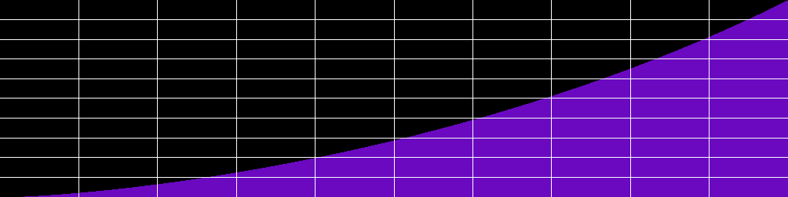
  

C++ :

```c++

hypercurve::share( hypercurve::diocles_curve(double a) );

// Alias

hypercurve::share( hypercurve::cissoid_curve(double a) );

```

Lua :

```Lua

hc.diocles(number  a)

-- Alias

hc.cissoid(a)

```

Csound :

```Csound

hc_diocles(float iarg_a)

// Alias

hc_cissoid(float iarg_a)

```

  

#### Cubic curve

  
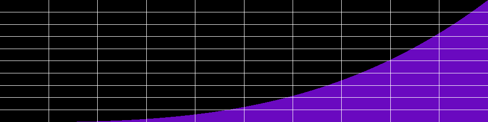

C++ :

```c++

hypercurve::share( hypercurve::cubic_curve() );

```

Lua :

```Lua

hc.cubic()

```

Csound :

```Csound

hc_cubic_curve()

```

  

#### Power curve

  
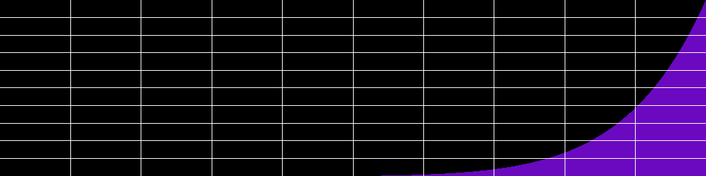

C++ :

```c++

hypercurve::share( hypercurve::power_curve(double power) );

```

Lua :

```Lua

hc.power(number  power)

```

Csound :

```Csound

hc_power_curve(float ipower)

```

#### Hamming Hanning Blackman curves

  
* Hanning 

* Hamming 
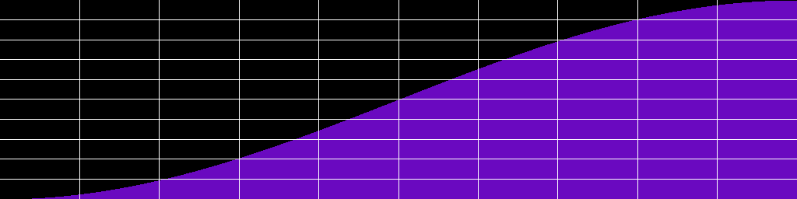
* Blackman
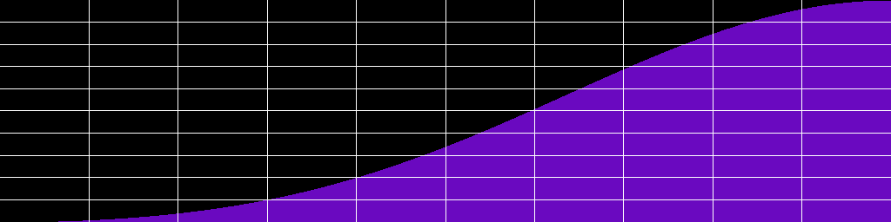

C++ :

```c++

hypercurve::share( hypercurve::hamming_curve() );

hypercurve::share( hypercurve::hanning_curve() );

hypercurve::share( hypercurve::blackman_curve() );

```

Lua :

```Lua

hc.hamming()

hc.hanning()

hc.blackman()

```

Csound :

```Csound

hc_hamming_curve()

hc_hanning_curve()

hc_blackman_curve()

```

#### Gaussian curve
  
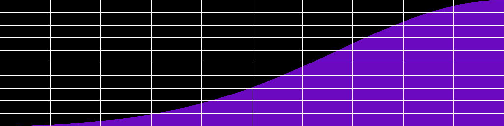

C++ :

```c++

hypercurve::share( hypercurve::gaussian_curve(double A, double c) );

// Alias

hypercurve::share( hypercurve::gauss_curve(double A, double c) );

  

```

Lua :

```Lua

hc.gaussian(number  A, number  c)

-- Alias

hc.gauss(number  A, number  c)

```

Csound :

```Csound

hc_gaussian_curve(float iA, float ic)

// Alias

hc_gauss_curve(float iA, float ic)

```

  

#### Toxoid curve

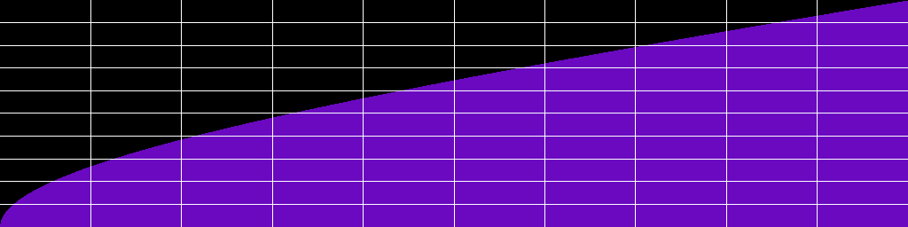

C++ :

```c++

hypercurve::share( hypercurve::toxoid_curve(double a) );

// Alias

hypercurve::share( hypercurve::duplicatrix_cubic_curve(double a) );

```

Lua :

```Lua

hc.toxoid(number  a)

-- Alias

hc.duplicatrix_cubic(number  a)

```

Csound :

```Csound

hc_toxoid_curve(float ia)

// Alias

hc_duplicatrix_cubic_curve(float ia)

```

  

#### Catenary curve

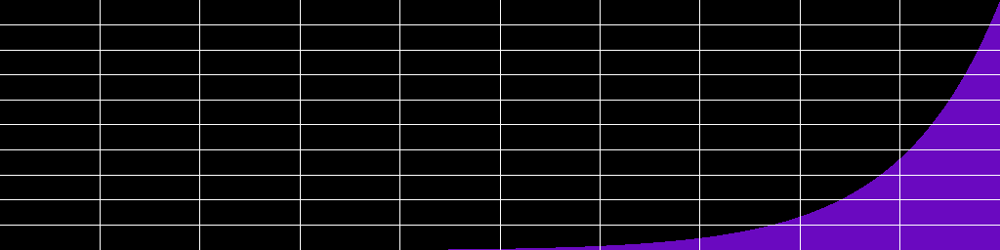

C++ :

```c++

hypercurve::share( hypercurve::catenary_curve(double a) );

// Alias

hypercurve::share( hypercurve::funicular_curve(double a) );

```

Lua :

```Lua

hc.catenary(number  a)

-- Alias

hc.funicular(number  a)

```

Csound :

```Csound

hc_catenary_curve(float ia)

// Alias

hc_funicular_curve(float ia)

```

  
  
  

#### Tightrope Walker curve

  
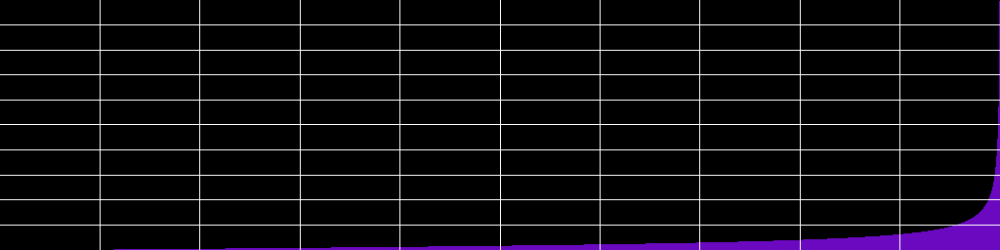

C++ :

```c++

hypercurve::share( hypercurve::tightrope_walker_curve(double a, double b) );

```

Lua :

```Lua

hc.tightrope_walker(number  a, number  b)

```

Csound :

```Csound

hc_tightrope_walker_curve(float ia, float ib)

```

  
  

#### Quadratic Bezier curve


C++ :

```c++

hypercurve::share( hypercurve::quadratic_bezier_curve( hypercurve::control_point cp ) );

```

Lua :

```Lua

hc.quadratic_bezier( hc.control_point  cp )

```

Csound :

```Csound

hc_quadratic_bezier_curve( hc_control_point cp )

```

  
  

#### Cubic Bezier curve

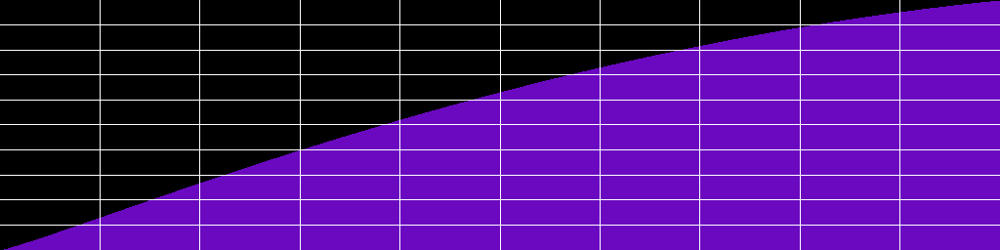

C++ :

```c++

hypercurve::share( hypercurve::cubic_bezier_curve( hypercurve::control_point cp1, hypercurve::control_point cp2) );

```

Lua :

```Lua

hc.cubic_bezier(hc.control_point  cp1, hc.control_point  cp2)

```

Csound :

```Csound

hc_cubic_bezier_curve(hc_control_point cp1, hc_control_point cp2)

```

  
  

#### Cubic spline curve

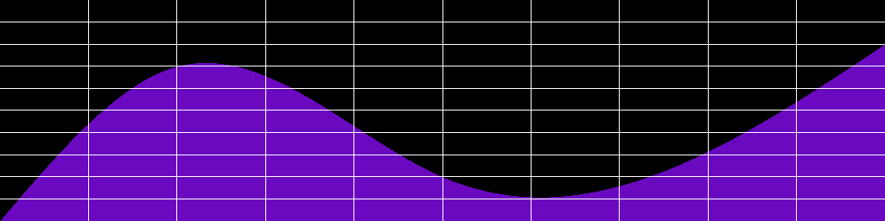

C++ :

```c++

hypercurve::share(hypercurve::cubic_spline_curve(std::vector<control_point> cp_list) );

```

Lua :

```Lua

hc.cubic_spline(table {hc.control_point})

```

Csound :

```Csound

// Not implemented yet

```

  
  

#### Catmull Rom spline curve

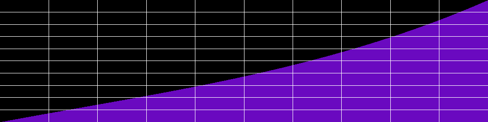
  

C++ :

```c++

hypercurve::share( hypercurve::catmull_rom_spline_curve( hypercurve::control_point cp1, hypercurve::control_point cp2) );

```

Lua :

```Lua

hc.catmull_rom_spline(hc.control_point  cp1, hc.control_point  cp2)

```

Csound :

```Csound

hc_catmull_rom_spline_curve(hc_control_point cp1, hc_control_point cp2)

```
