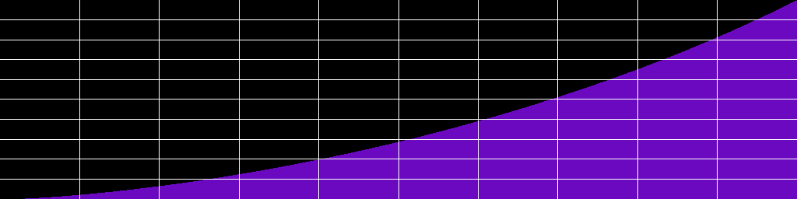
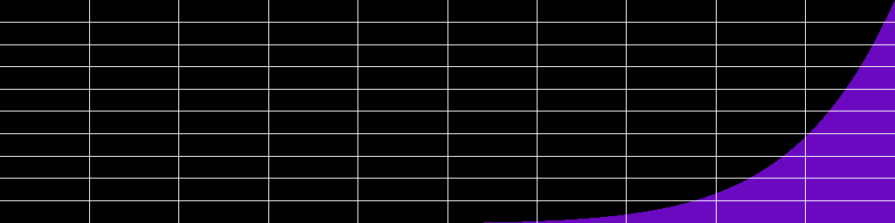
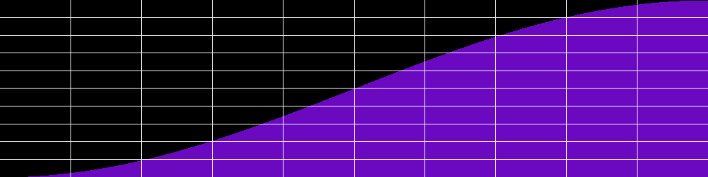
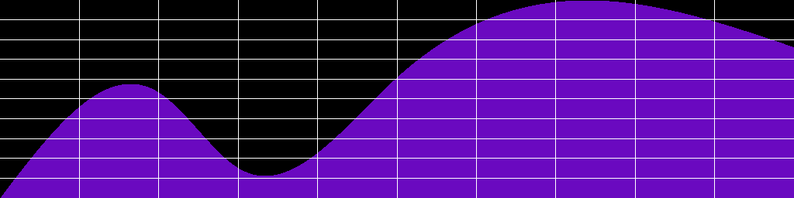

# Hypercurve documentation

  


Hypercurve is a library of 2D curves designed to process audio envelopes, applied to any audio parameter.
It is available in several frontends : C++, Lua, and Csound.

1. [Hypercurve basic syntax](#hypercurve-basic-syntax)
2. [Import Hypercurve](#import-hypercurve)
3. [Hypercurve class](#hypercurve-class)
4. [Hypercurve Segment](#segment)
5. [Control point](#control-point)
6. [Curve Algorithms](#curve-base)
    
    6.1. [Diocles cissoid curve](#diocles-cissoid-curve)
    
    6.2. [Cubic curve](#cubic-curve)
    
    6.3. [Power curve](#power-curve)
    
    6.4 [FFT Window curves](#hamming-hanning-blackman-curves)
    
    6.5 [Gaussian curve](#gaussian-curve)
    
    6.6 [Toxoid curve](#toxoid-curve)
    
    6.7 [Catenary curve](#catenary-curve)
    
    6.8 [Tightrope Walker curve](#tightrope-walker-curve)
    
    6.9 [Quadratic bezier curve](#quadratic-bezier-curve)
    
    6.10 [Cubic bezier curve](#cubic-bezier-curve)
    
    6.11 [Cubic spline curve](#cubic-spline-curve)
    
    6.12 [Catmull Rom Spline curve](#catmull-rom-spline-curve)
    
    6.13 [Polynomial Curve](#polynomial-curve)
    
    6.14 [User defined Curve](#user-defined-curve)
    
    6.15 [Typed Curve](#typed-curve)
    
    6.16 [Mouth Curve](#mouth-curve)
    
    6.16 [Bicorn Curve](#bicorn-curve)
    
    6.17 [Lagrange Polynomial Curve](#lagrange-polynomial-curve)
        
    6.18 [Logarithmic Curve](#logarithmic-curve)
    
    6.19 [Exponential Curve](#Exponential-curve)

7. [Manipulation Tools](#manipulation-tools)
    
    7.1 [Hypercurve operators](#hypercurve-operators)
    
    7.2 [Invert curve base](#invert-curve-base)
    
    7.3 [Mirror curve base](#mirror-curve-base)
    
    7.4 [Scale hypercurve](#scale-hypercurve)
    
    7.5 [Concatenate hypercurves](#concatenate-hypercurves)
    
    7.6 [Resize hypercurve](#resize-hypercurve)

## Hypercurve basic syntax


Here is a simple example of syntax with possible use cases :

  

C++ :

```c++

auto crv = hypercurve::hypercurve( 2048, 0, {
    // In C++, segment is expecting a curve_base of type shared_ptr

hypercurve::segment(0.5, 1, hypercurve::share(hypercurve::cubic_curve())),

hypercurve::segment(0.5, 0, hypercurve::share(hypercurve::diocles_curve(1)))

});

  // Get samples values like below

double sample = crv.get_sample_at(1024);

double *samples = crv.get_samples();

  
// Write the curve as PNG file

hypercurve::png png;

bool fill = true;

bool waveform = false;

png.draw_curve(samples, crv.get_definition(), fill, waveform);

png.write_png("my/path/to.png");

// Write the curve as WAV file (Sndfile is linked to hypercurve)

SndfileHandle sf(path , SFM_WRITE, SF_FORMAT_WAV | SF_FORMAT_PCM_24, 1, 48000);

sf.writef(crv.get_samples(), crv.get_definition());

```

  

Lua :

```Lua

local  crv = hc.hypercurve(2048, 0, {

hc.segment(0.5, 1, hc.cubic_curve())

hc.segment(0.5, 0, hc.cissoid_curve(1))

})

  

crv:ascii_display("MyHybridCurve", "half cubic, half cissoid", "*")

local  fill = true -- optional default to true

local  is_waveform = false -- optional, default to false ,waveform will scale the png from -1 to 1

local draw_grid = true -- optional, default to true
 
local invert_color = false -- optional, default to false

crv:write_as_png("path_to/curve.png", is_waveform, fill, draw_grid, invert_color) -- arguments after path are optional

crv:write_as_wav( "path/curve.wav" )
  

-- rescale the curve

crv:scale(-1, 1)

local  samp = crv:get_sample_at(1024)

local  samps = crv:get_samples()

```

  

Csound :

```Csound

icrv = hc_hypercurve(0, 2048, 0,

hc_segment(0.5, 1, hc_cubic_curve()),

hc_segment(0.5, 0, hc_cissoid_curve(1)))

// Arguments after  path are optional
// is_waveform (0 or 1) default to 0
// fill (0 or 1) default to 1
// draw_grid (0 or 1) default to 1
// invert_color (0 or 1) default to 0
hc_write_as_png(icrv, "my/path/curve.png", 0, 1, 1, 1)

// Alias for hc_hypercurve is hc_gen
gidiocles = hc_gen(0, 2048, 0, 
              hc_segment(1/2, 1, hc_diocles_curve(0.51)), 
              hc_segment(1/2, 0, hc_diocles_curve(1.5)))

// It can then be used as any FTable, with Csound opcodes that use FTables
kenv = tablei:k(linseg(0, p3, 1), gidiocles, 1)

```

  
Faust : 
```
curve = hc.hypercurve(2048, 0, (
  hc.segment(0.5, 1, hc.cubic_curve()), 
  hc.segment(0.5, 0, hc.cissoid_curve(0.6)) 
  ));

env = hc.run(curve, os.phasor(1, 1));

```
  

## Import hypercurve

  

C++ :

```c++

#include"hypercurve.h"

```

Lua :

```Lua

-- In the following line, replace .so with your library extension (dll on Windows or dylib on Macos)

package.cpath = package.cpath .. ";/your/path/to/hypercurve/?.so"

local  hc = require("liblua_hypercurve")

```

Csound :

In csound you can manually import the library like below, or simply put the library in csound plugins path.

```Csound

<CsOptions>

--opcode-lib=/your/path/to/libcsound_hypercurve.so

</CsOptions>

```

Faust : 
```
hc = library("hypercurve.lib");
```
  

## Hypercurve class

 
C++ :

```c++

auto crv = hypercurve::curve(size_t size_in_samples, double y_start, std::vector<hypercurve::segment> segment_list);

// With possible alias

auto crv = hypercurve::curve(size_t size_in_samples, double y_start, std::vector<hypercurve::segment> segment_list);

```

Lua :

```Lua

local  crv = hc.hypercurve(integer  size_in_samples, number  y_start, table {segments})

```

Csound :

```Csound

icrv = hc_hypercurve(int isize_in_samples, float iy_start, isegment1 , [isegment2, isegment3...])

```

Faust : 
```
curve = hc.hypercurve(int size_in_samples, float y_start, (list_of_segments) );
```

## Segment

An hypercurve is composed with a list of one or more segments. Each segment have a fractional size (0-1 range), a destination in y axis, and a curve_base wich represents the algorithm. 

C++ :

```c++

auto seg = hypercurve::segment(double fractional_size, double y_destination, std::shared_ptr<curve_base> curve_type);

```

Lua :

```Lua

local  seg = hc.segment(number  fractional_size, number  y_destination, curve_base)

```

Csound :

```Csound

iseg = hc_segment(float fractional_size, float y_destination, curve_base icrv_base)

```

Faust : 
```
seg = hc.segment(float fractional_size, float y_destination, curve_base crv_base);
```

## Control point

Some curve_base algorithms need control points to process their interpolation : splines and bezier curves. 
A control point is a simple point in 2D space with x and y position. Be careful that control points x position is an absolute position in the segment. If you specify a control point with x = 0.5, then the control point will stand in the middle of the segment. 

C++ :

```c++

hypercurve::control_point(0.5, 0.8);
// Alias
hypercurve::point(0.5, 0.8);
// Can also be passed with {}
hypercurve::quadratic_bezier_curve({0.5, 0.8});

```

Lua :

```Lua

hc.control_point(0.5, 0.8)
-- Alias
hc.point(0.5, 0.8)

```

Csound :

```Csound

hc_control_point(0.5, 0.8)
// Alias
hc_point(0.5, 0.8)

```

Faust : 
```
hc.control_point(0.5, 0.7);
hc.point(0.3, 0.8);
```
  

C++ :

```c++

hypercurve::share( )

```

Lua :

```Lua

hc.

```

Csound :

```Csound

hc_

```

Faust : 
```
hc.
```


## Curve Base

  

In Hypercurve, a Curve base represents the algorithm of a specific curve. Some of them take one or several constant parameters.
You should remember algorithms implementations are most of the time approximations of the curve equations. 
Indeed, many curve equations are not easy to scale and normalize, since their behavior tends to infinity.
So in many cases (e.g. hamming, gaussian...) I had to find a logical rule to force the curves to respect Hypercurve composition rules (normalizable, scalable). 

  

#### Diocles cissoid curve


  
Diocles curve takes 1 argument `a` which must be in range `0.5 < a < inf`. The more a increases, the more linear the curve becomes. Otherwise, diocles curve is a concave curve.

C++ :

```c++

hypercurve::share( hypercurve::diocles_curve(double a) );

// Alias

hypercurve::share( hypercurve::cissoid_curve(double a) );

```

Lua :

```Lua

hc.diocles_curve(number  a)

-- Alias

hc.cissoid_curve(a)

```

Csound :

```Csound

hc_diocles(float iarg_a)

// Alias

hc_cissoid(float iarg_a)

```

Faust : 
```
hc.diocles_curve(float a);

// Alias

hc.cissoid(float a);

```
  

#### Cubic curve

  


C++ :

```c++

hypercurve::share( hypercurve::cubic_curve() );

```

Lua :

```Lua

hc.cubic_curve()

```

Csound :

```Csound

hc_cubic_curve()

```

  
Faust : 
```
hc.cubic_curve;

```


#### Power curve

  


The power curve takes one argument, which is the exponent of power operation. The more `power` is important, the more concave the curve is.
A power of 1 will create a linear curve.

C++ :

```c++

hypercurve::share( hypercurve::power_curve(double power) );

```

Lua :

```Lua

hc.power_curve(number  power)

```

Csound :

```Csound

hc_power_curve(float ipower)

```


Faust : 
```
hc.power_curve(float exponent);

```


#### Hamming Hanning Blackman curves

  
* Hanning 

* Hamming 

* Blackman


The Hamming implementation is an approximation, since the curve itself starts at y = 0.08 for x = 0. So it had to be stretched up a little bit to allow hypercurve to do its job.

C++ :

```c++

hypercurve::share( hypercurve::hamming_curve() );

hypercurve::share( hypercurve::hanning_curve() );

hypercurve::share( hypercurve::blackman_curve() );

```

Lua :

```Lua

hc.hamming_curve()

hc.hanning_curve()

hc.blackman_curve()

```

Csound :

```Csound

hc_hamming_curve()

hc_hanning_curve()

hc_blackman_curve()

```


Faust : 
```
hc.hamming;
hc.hanning;
hc.blackman;
```

#### Gaussian curve
  


The gaussian curve takes two parameterrs `A` and `c`. The most important parameter is `c`. A lower value will result in a more carved curve. Higher values will look more like a roundish curve. The `A` parameter does not seem really significant in this implementation. Though, changing it does not return strictly the same results. `c` argument is usually in range `0 < c < inf`

C++ :

```c++

hypercurve::share( hypercurve::gaussian_curve(double A, double c) );

// Alias

hypercurve::share( hypercurve::gauss_curve(double A, double c) );

  

```

Lua :

```Lua

hc.gaussian_curve(number  A, number  c)

-- Alias

hc.gauss_curve(number  A, number  c)

```

Csound :

```Csound

hc_gaussian_curve(float iA, float ic)

// Alias

hc_gauss_curve(float iA, float ic)

```

Faust : 
```
hc.gaussian_curve(float A, float c);

// Alias

hc.gauss_curve(float A, float c);

```

#### Toxoid curve


The parameter `a` is usually in range `0 < a < inf`. Low values for `a` will return more concave results, while higher values will return more convex curves. 

C++ :

```c++

hypercurve::share( hypercurve::toxoid_curve(double a) );

// Alias

hypercurve::share( hypercurve::duplicatrix_cubic_curve(double a) );

```

Lua :

```Lua

hc.toxoid_curve(number  a)

-- Alias

hc.duplicatrix_cubic_curve(number  a)

```

Csound :

```Csound

hc_toxoid_curve(float ia)

// Alias

hc_duplicatrix_cubic_curve(float ia)

```

Faust : 
```
hc.toxoid_curve(float a);

// Alias

hc.duplicatrix_cubic_curve(float a);

```
  

#### Catenary curve


Relevant values for `a` argument are in range `0 < a < 2`. The more `a` tends to 0, the more it is concave. 

C++ :

```c++

hypercurve::share( hypercurve::catenary_curve(double a) );

// Alias

hypercurve::share( hypercurve::funicular_curve(double a) );

```

Lua :

```Lua

hc.catenary_curve(number  a)

-- Alias

hc.funicular_curve(number  a)

```

Csound :

```Csound

hc_catenary_curve(float ia)

// Alias

hc_funicular_curve(float ia)

```

Faust : 
```
hc.catenary_curve(float a);
hc.funicular_curve(float a);
```
  
  
  

#### Tightrope Walker curve

  


In this particular case, `a` must be superior to `abs(b)` and `a` must be superior to `0` (quite logical here). 
Here, it is the distance between `a` and `abs(b)` that will is interesting. A big distance (e.g. a = 1.0, b = 0.1) will create a hardcore concave curve (useful for quick attack envelopes). But a smaller distance (a = 1.01, b = 1) will create a big bump before the attack segment. 


C++ :

```c++

hypercurve::share( hypercurve::tightrope_walker_curve(double a, double b) );

```

Lua :

```Lua

hc.tightrope_walker_curve(number  a, number  b)

```

Csound :

```Csound

hc_tightrope_walker_curve(float ia, float ib)

```

  
  

#### Quadratic Bezier curve


Quadratic bezier curve must be passed a control point. This point will shape the curve. Notice that the x position of the point must be defined in absolute coordinates of the segment. So for example the point :  `point{0.5, 0.2}` will be located in the middle of the segment. 

C++ :

```c++

hypercurve::share( hypercurve::quadratic_bezier_curve( hypercurve::control_point cp ) );

```

Lua :

```Lua

hc.quadratic_bezier_curve( hc.control_point  cp )

```

Csound :

```Csound

hc_quadratic_bezier_curve( hc_control_point cp )

```

Faust : 
```
hc.quadratic_bezier_curve(hc.control_point cp);

```
  

#### Cubic Bezier curve


Same as for quadratic bezier curve, except that you need to specify two control points here. Make sure that the second point is located after the first one, else your curve might be coming back in the x axis, wich as an audio envelope might mean return back in the past (not so good). 

C++ :

```c++

hypercurve::share( hypercurve::cubic_bezier_curve( hypercurve::control_point cp1, hypercurve::control_point cp2) );

```

Lua :

```Lua

hc.cubic_bezier_curve(hc.control_point  cp1, hc.control_point  cp2)

```

Csound :

```Csound

hc_cubic_bezier_curve(hc_control_point cp1, hc_control_point cp2)

```

  
Faust : 
```
hc.cubic_bezier_curve(hc.control_point cp1, hc.control_point cp2);

```
  

#### Cubic spline curve



Cubic spline curve is similar to Csound's [GEN08](http://www.csounds.com/manual/html/GEN08.html). You pass it a list of any number of control points. The difference with Bezier curves is that your segment will actually pass through all of these control points. This curve may sometime need to be rescaled, since the deviation of the curve can go across the limits of your y origin and destination. X coordinates of control points must be absolute coordinates (inside the segment, so between 0 and 1).

C++ :

```c++

hypercurve::share(hypercurve::cubic_spline_curve(std::vector<control_point> cp_list) );

```

Lua :

```Lua

hc.cubic_spline_curve(table {hc.control_point})

```

Csound :

```Csound

hc_cubic_spline_curve(hc_control_point p1, [hc_control_point p2, ...])

```

  
Faust : 
```
hc.cubic_spline_curve( (hc.control_point point_list) );

```
  

#### Catmull Rom spline curve


  
Another spline curve. Like cubic bezier it receives 2 control points. BUT the catmull rom control points X coordinates must be outside the segment. So cp1.x must be < 0 and cp2.x must be > 1. 

C++ :

```c++

hypercurve::share( hypercurve::catmull_rom_spline_curve( hypercurve::control_point cp1, hypercurve::control_point cp2) );

```

Lua :

```Lua

hc.catmull_rom_spline_curve(hc.control_point  cp1, hc.control_point  cp2)

```

Csound :

```Csound

hc_catmull_rom_spline_curve(hc_control_point cp1, hc_control_point cp2)

```

Faust : 
```
hc.catmull_rom_spline_curve(hc.control_point cp1, hc.control_point cp2);

```


#### Polynomial curve

The polynomial curve accepts an infinite number of arguments (up to 64 for Csound) and will evaluate curve with a polynomial expression  : 
`(arg1*x)^3 + (arg2*x)^2 + (arg1*x)^1`
In audio context, it is safer to scale the hypercurve in which you use a polynomial, as its y scale may be uncertain. Use the `normalize` or `scale` method on your hypercurve to do so.


  

C++ :

```c++

hypercurve::share( hypercurve::polynomial_curve( {1.34, -1, -0.5, 0.1} ) );

```

Lua :

```Lua
hc.polynomial_curve(1.34, -1, -0.5, 0.1)
```

Csound :

```Csound
hc_polynomial_curve(1.34, -1, -0.5, 0.1)

```


Faust : 
```
hc.polynomial_curve( (float arguments_list) );

```

#### User defined curve


User defined curve allows you to pass your own function that will return `y` for each `x` between 0 and 1. 


  

C++ :

```c++

hypercurve::share( hypercurve::user_defined_curve(
      [](double x){
        return x * x * x;
      }
      ));

```

Lua :

```Lua
hc.user_defined(function(x) return x * x * x end )
-- Alternatively, you can pass it a named function
function my_own_cubic(x)
  return x*x*x
end
hc.user_defined_curve(my_own_cubic)
```

Csound :

```Csound
;Not implemented

```

Faust : 
```
// Not implemented

```

#### Typed Curve


Typed curve allows you to define a curve factor between -10 and 10 (concave or convex). It is based on Csound [GEN16 formula](http://www.csounds.com/manual/html/GEN16.html). Because of Hypercurve architecture, a increasing segment of typed curve will be inverted (concave instead of convex and convex instead of concave) in comparison to csound GEN16. So type > 0 means convex, type < 0 means concave


  

C++ :

```c++

hypercurve::share( hypercurve::typed_curve(-5));

```

Lua :

```Lua
hc.typed_curve(-5)
```

Csound :

```Csound
hc_typed_curve(-5)

```

Faust : 
```
hc.typed_curve(9.5);

```

  
#### Mouse Curve


  

C++ :

```c++

hypercurve::share( hypercurve::mouth_curve());
// Alias
hypercurve::share( hypercurve::kiss_curve());

```

Lua :

```Lua
hc.mouth_curve()
-- Alias
hc.kiss_curve()
```

Csound :

```Csound
hc_mouth_curve()
// Alias
hc_kiss_curve()

```

Faust : 
```
hc.mouth_curve();
// Alias
hc.kiss_curve();

```

#### Bicorn Curve


  

C++ :

```c++

hypercurve::share( hypercurve::bicorn_curve(bool ));
// Alias
hypercurve::share( hypercurve::cocked_hat_curve(bool));

```

Lua :

```Lua
hc.bicorn_curve(bool 0 or 1)
-- Alias
hc.cocked_hat_curve(bool 0 or 1)
```

Csound :

```Csound
hc_bicorn_curve(bool 0 or 1)
// Alias
hc_cocked_hat_curve(bool 0 or 1)

```

Faust : 
```
hc.bicorn_curve(bool 0 or 1);
// Alias
hc.cocked_hat_curve(bool 0 or 1);

```


#### Lagrange polynomial curve


  
Like cubic spline, lagrange interpolation takes a list of control points with 0 < x < 1. 

C++ :

```c++

hypercurve::share( hypercurve::lagrange_polynomial_curve( {control_point(0.2, 0.8), control_point(0.4, 0.1)} ) );

```

Lua :

```Lua
hc.lagrange_polynomial_curve( hc.control_point(0.2, 0.8), hc.control_point(0.4, 0.2) )
```

Csound :

```Csound
hc_lagrange_polynomial_curve( hc_control_point(0.2, 0.8), hc_control_point(0.4, 0.2))

```

Faust : 
```
hc.lagrange_polynomial_curve( (hc.control_point(0.2, 0.8), hc.control_point(0.4, 0.1)) );
```

#### Logarithmic Curve


  
Like cubic spline, lagrange interpolation takes a list of control points with 0 < x < 1. 

C++ :

```c++

hypercurve::share( hypercurve::logarithmic_curve());

```

Lua :

```Lua
hc.logarithmic_curve()
```

Csound :

```Csound
hc_logarithmic_curve()

```

Faust : 
```
hc.logarithmic_curve();
```


### Manipulation Tools

#### Hypercurve Operators 

Hypercurves can be combined with + - * / operators
You are allowed to combine curve and numbers with these operators (for example mycurve * 2). 
In Csound and Faust, those are implemented as separate functions. 


C++ :

```c++

  hypercurve::curve c1(2048, 0, {hypercurve::segment(1, 1, hypercurve::share(hypercurve::cubic_curve()))});
  hypercurve::curve c2(2048, 0, {hypercurve::segment(1, 1, hypercurve::share(hypercurve::diocles_curve(1)))});
  hypercurve::curve sum = c1 + c2; 
  hypercurve::curve sub = c1 - c2; 
  hypercurve::curve prod = c1 * c2; 
  hypercurve::curve div = c1 / c2; 
  // Or 
  c1 += c2;
  c1 -= c2;
  c1 *= c2;
  c1 /= c2;

  // It works for all mathematic operators +, -, /, *
```

Lua :

```Lua

  local c1 = hc.hypercurve(2048, 0, {hc.segment(1, 1, hc.cubic_curve())})
  local c2 = hc.hypercurve(2048, 0, {hc.segment(1, 1, hc.diocles_curve(1))})
  local add = c1 + c2
  local sub = c1 - c2
  local prod = c1 * c2
  local div = c1 / c2
```

Csound :

```Csound
  icrv1 = hc_hypercurve(2048, 0, hc_segment(1, 1, hc_cubic_curve()))
  icrv2 = hc_hypercurve(2048, 0, hc_segment(1, 1, hc_diocles_curve(1)))
  icrv_sum = hc_add(icrv1, icrv2)
  icrv_sub = hc_sub(icrv1, icrv2)
  icrv_prod = hc_mult(icrv1, icrv2)
  icrv_div = hc_div(icrv1, icrv2)

  icrv_sum = hc_add(icrv1, 2)
  // ... 
```


Faust : 
```
crv1 = hc.hypercurve(2048, 0, (hc.segment(1, 1, hc.cubic_curve)));
crv2 = hc.hypercurve(2048, 0, (hc.segment(1, 1, hc.diocles_curve(1))));

crv_sum = hc.sum(crv1, crv2);
crv_sub = hc.sub(crv1, crv2);
crv_mult = hc.mult(crv1, crv2);
crv_div = hc.div(crv1, crv2);

```


#### Invert curve base 

Vertical symetry of the curve base.


C++ :

```c++

hypercurve::invert(hypercurve::share( hypercurve::cubic_curve() ));

```

Lua :

```Lua

hc.invert(hc.cubic_curve())

```

Csound :

```Csound

hc_invert(hc_cubic_curve())

```

Faust : 
```
hc.invert(hc.cubic_curve());
```


#### Mirror curve base

This function will make a symetry of the curve on a x_start/y_start - x_destination/y_destination axis

C++ :

```c++

hypercurve::mirror(hypercurve::share( hypercurve::cubic_curve() ));

```

Lua :

```Lua

hc.mirror(hc.cubic_curve())

```

Csound :

```Csound

hc_mirror(hc_cubic_curve())

```

Faust : 
```
hc.mirror(hc.cubic_curve());
```


#### Scale hypercurve

This functions will allow you to scale or normalize an hypercurve between min and max y values
The scale function allows you to rescale an entire HYPERCURVE, while normalize or norm will scale between 0 and 1. 

C++ :

```c++
  hypercurve::curve c(4096, 0, {hypercurve::segment(1, 1, hypercurve::cubic_curve())});
  c.scale(-1, 1);
  // normalize scales between 0 and 1
  c.normalize();
  c.norm();
  // Now "c" curve y start is -1 and its destination is 1

```

Lua :

```Lua
  local crv = hc.hypercurve(4096, 0, {hc.segment(1, 1, hc.cubic_curve())})
  crv:scale(-1, 1)
  crv:normalize()
  crv:norm()
```

Csound :

```Csound

  icrv = hc_hypercurve(4096, 0, hc_segment(1, 1, hc_cubic_curve()))
  // This function won't make a copy, it will only scale the corresponding curve
  hc_scale(icrv, -1, 1)
  hc_normalize(icrv)
  hc_norm(icrv)
``` 


Faust : 
```
crv = hc.hypercurve(2048, 0, (hc.segment(1, 1, hc.cubic_curve())))
hc.scale(crv, -1, 1);
hc.normalize(crv);
hc.norm(crv);
```


### Concatenate hypercurves

This function allows to contacenate two or more curves 

C++ :

```c++

curve concatenated = hypercurve::concatenate(size_t new_size, {hypercurve::curve &crv1, hypercurve::curve &crv2, [...] } )
// concat is an alias (also, the same function exist as a hypercurve::curve constructor)
```

Lua :

```Lua

local new_crv = hc.concatenate(new_size, {curve_list})
-- hc.concat is an alias

```

Csound :

```Csound

iconcatenated = hc_concatenate(inew_ftable_number, inew_size, icrv1, [icrv2, ...] )
; hc_concat is an alias

```

Faust : 
```
// Not implemented yet
```

### Resize hypercurve


  


