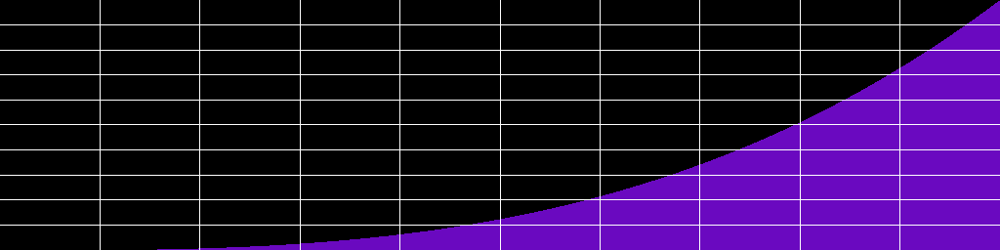
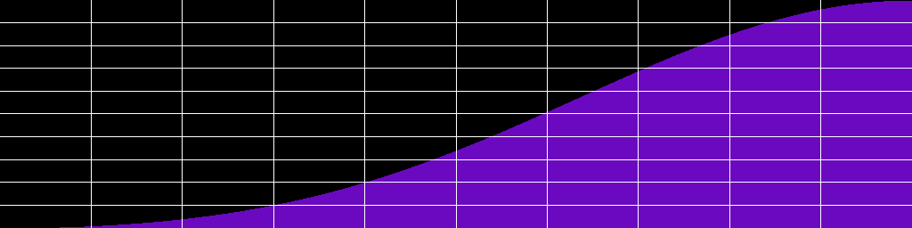
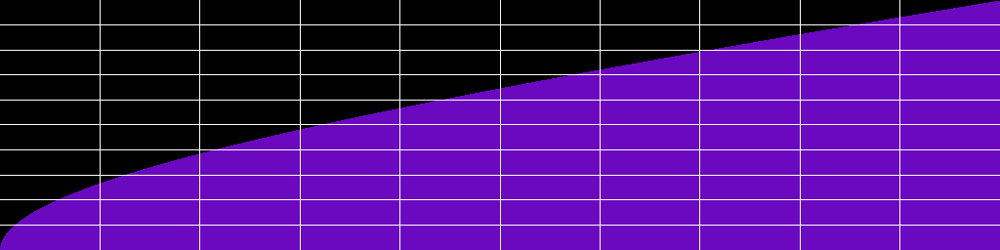
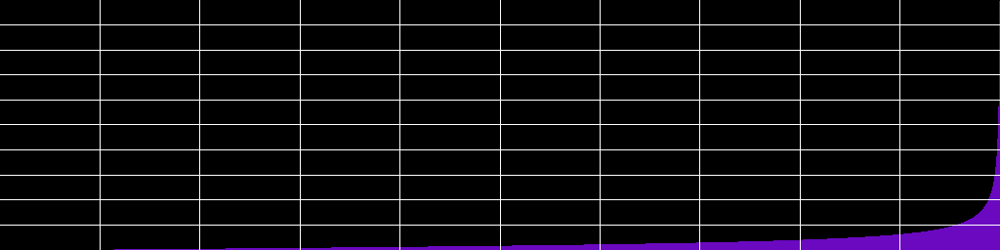
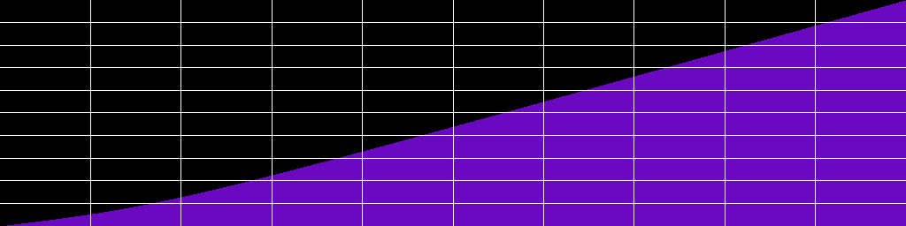
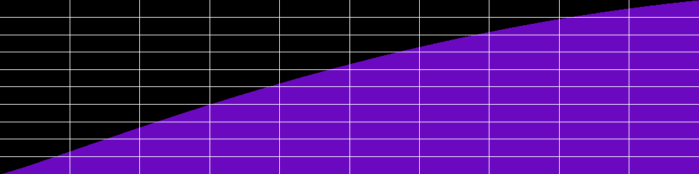

# Hypercurve Documentation


Hypercurve is a library of 2D curves designed to process audio envelopes, applied to any audio parameter. It is available in several frontends: C++, Lua, Faust, and Csound.

## Table of Contents

- [Hypercurve Documentation](#hypercurve-documentation)
  - [Hypercurve Basic Syntax](#hypercurve-basic-syntax)
  - [Import Hypercurve](#import-hypercurve)
  - [Hypercurve Class](#hypercurve-class)
  - [Segment](#segment)
  - [Control Point](#control-point)
  - [Curve Base](#curve-base)
    - [Diocles Cissoid Curve](#diocles-cissoid-curve)
    - [Cubic Curve](#cubic-curve)
    - [Power Curve](#power-curve)
    - [Hamming, Hanning, Blackman Curves](#hamming-hanning-blackman-curves)
    - [Gaussian Curve](#gaussian-curve)
    - [Toxoid Curve](#toxoid-curve)
    - [Catenary Curve](#catenary-curve)
    - [Tightrope Walker Curve](#tightrope-walker-curve)
    - [Quadratic Bezier Curve](#quadratic-bezier-curve)
    - [Cubic Bezier Curve](#cubic-bezier-curve)
    - [Cubic Spline Curve](#cubic-spline-curve)
    - [Catmull-Rom Spline Curve](#catmull-rom-spline-curve)
    - [Polynomial Curve](#polynomial-curve)
    - [User Defined Curve](#user-defined-curve)
    - [Typed Curve](#typed-curve)
    - [Mouse Curve](#mouse-curve)
    - [Bicorn Curve](#bicorn-curve)
    - [Lagrange Polynomial Curve](#lagrange-polynomial-curve)
    - [Logarithmic and Exponential Curve](#logarithmic-and-exponential-curve)
    - [Easing Curves](#easing-curves)
  - [Manipulation Tools](#manipulation-tools)
    - [Hypercurve Operators](#hypercurve-operators)
    - [Mirror Curve Base](#mirror-curve-base)
  - [Concatenate Hypercurves](#concatenate-hypercurves)
  - [Utilities](#utilities)

8 [Utilities](#utilities)

## Hypercurve Basic Syntax

Here is a simple example of syntax with possible use cases:

### C++:

```c++
auto crv = hypercurve::hypercurve(2048, 0, {
// In C++, segment is expecting a curve_base of type shared_ptr
hypercurve::segment(0.5, 1, hypercurve::share(hypercurve::cubic_curve())),
hypercurve::segment(0.5, 0, hypercurve::share(hypercurve::diocles_curve(1)))
});

// Get sample values
double sample = crv.get_sample_at(1024);
double *samples = crv.get_samples();

// Write the curve as a PNG file
hypercurve::png png;
bool fill = true;
bool waveform = false;
png.draw_curve(samples, crv.get_definition(), fill, waveform);
png.write_png("my/path/to.png");

// Write the curve as a WAV file (Sndfile is linked to hypercurve)
SndfileHandle sf(path, SFM_WRITE, SF_FORMAT_WAV | SF_FORMAT_PCM_24, 1, 48000);
sf.writef(crv.get_samples(), crv.get_definition());
```

### Lua:

```lua
local crv = hc.hypercurve(2048, 0, {
hc.segment(0.5, 1, hc.cubic_curve()),
hc.segment(0.5, 0, hc.cissoid_curve(1))
})

crv:ascii_display("MyHybridCurve", "half cubic, half cissoid", "*")

local fill = true -- optional, defaults to true
local is_waveform = false -- optional, defaults to false, waveform will scale the PNG from -1 to 1
local draw_grid = true -- optional, defaults to true
local invert_color = false -- optional, defaults to false

crv:write_as_png("path_to/curve.png", is_waveform, fill, draw_grid, invert_color) -- arguments after path are optional
crv:write_as_wav("path/curve.wav")

-- Rescale the curve
crv:scale(-1, 1)

local samp = crv:get_sample_at(1024)
local samps = crv:get_samples()
```

### Csound:

```csound
icrv = hc_hypercurve(0, 2048, 0,
hc_segment(0.5, 1, hc_cubic_curve()),
hc_segment(0.5, 0, hc_cissoid_curve(1))
)

// Arguments after path are optional
// is_waveform (0 or 1) default to 0
// fill (0 or 1) default to 1
// draw_grid (0 or 1) default to 1
// invert_color (0 or 1) default to 0
hc_write_as_png(icrv, "my/path/curve.png", 0, 1, 1, 1)

// Alias for hc_hypercurve is hc_gen
gidiocles = hc_gen(0, 2048, 0, 
hc_segment(1/2, 1, hc_diocles_curve(0.51)), 
hc_segment(1/2, 0, hc_diocles_curve(1.5)))

// It can then be used as any FTable, with Csound opcodes that use FTables
kenv = tablei:k(linseg(0, p3, 1), gidiocles, 1)
```

### Faust:

```faust
curve = hc.hypercurve(2048, 0, (
hc.segment(0.5, 1, hc.cubic_curve()), 
hc.segment(0.5, 0, hc.cissoid_curve(0.6)) 
));

env = hc.run(curve, os.phasor(1, 1));
```

## Import Hypercurve

### C++:

```c++
#include "hypercurve.h"
```

### Lua:

```lua
-- In the following line, replace .so with your library extension (dll on Windows or dylib on Macos)
package.cpath = package.cpath .. ";/your/path/to/hypercurve/?.so"
local hc = require("liblua_hypercurve")
```

### Csound:

In Csound, you can manually import the library as shown below, or simply place the library in the Csound plugins path.

```csound
<CsOptions>
--opcode-lib=/your/path/to/libcsound_hypercurve.so
</CsOptions>
```

### Faust:

```faust
hc = library("hypercurve.lib");
```

## Hypercurve Class

### C++:

```c++
auto crv = hypercurve::curve(size_t size_in_samples, double y_start, std::vector<hypercurve::segment> segment_list);

// With possible alias
auto crv = hypercurve::curve(size_t size_in_samples, double y_start, std::vector<hypercurve::segment> segment_list);
```

### Lua:

```lua
local crv = hc.hypercurve(integer size_in_samples, number y_start, table {segments})
```

### Csound:

```csound
icrv = hc_hypercurve(int isize_in_samples, float iy_start, isegment1, [isegment2, isegment3...])
```

### Faust:

```faust
curve = hc.hypercurve(size_in_samples, y_start, (list_of_segments));
```

## Segment

A hypercurve is composed of one or more segments. Each segment has a fractional size (0-1 range), a destination on the y-axis, and a curve_base, which represents the algorithm. 

### C++:

```c++
auto seg = hypercurve::segment(double fractional_size, double y_destination, std::shared_ptr<curve_base> curve_type);
```

### Lua:

```lua
local seg = hc.segment(number fractional_size, number y_destination, curve_base)
```

### Csound:

```csound
iseg = hc_segment(float fractional_size, float y_destination, curve_base, icrv_base)
```

### Faust:

```faust
seg = hc.segment(fractional_size, y_destination, curve_base, crv_base);
```

## Control Point

Some curve_base algorithms need control points to process their interpolation, such as splines and bezier curves. 
A control point is a simple point in 2D space with x and y positions. Note that the x position is an absolute position within the segment. If you specify a control point with x = 0.5, the control point will stand in the middle of the segment. 

### C++:

```c++
hypercurve::control_point(0.5, 0.8);
// Alias
hypercurve::point(0.5, 0.8);
// Can also be passed with {}
hypercurve::quadratic_bezier_curve({0.5, 0.8});
```

### Lua:

```lua
hc.control_point(0.5, 0.8)
-- Alias
hc.point(0.5, 0.8)
```

### Csound:

```csound
hc_control_point(0.5, 0.8)
// Alias
hc_point(0.5, 0.8)
```

### Faust:

```faust
hc.control_point(0.5, 0.7);
hc.point(0.3, 0.8);
```

## Curve Base

In Hypercurve, a curve base represents the algorithm of a specific curve. Some of them take one or several constant parameters.
You should remember that algorithms implementations are often approximations of the curve equations. 
Indeed, many curve equations are not easy to scale and normalize, as their behavior tends to infinity.
So in many cases (e.g., Hamming, Gaussian, etc.), I had to find a logical rule to force the curves to respect Hypercurve composition rules (normalizable, scalable).

### Diocles Cissoid Curve


  
Diocles curve takes one argument `a` which must be in the range `0.5 < a < inf`. The more `a` increases, the more linear the curve becomes. Otherwise, the Diocles curve is a concave curve.

#### C++:

```c++
hypercurve::share( hypercurve::diocles_curve(double a) );
// Alias
hypercurve::share( hypercurve::cissoid_curve(double a) );
```

#### Lua:

```lua
hc.diocles_curve(number a)
-- Alias
hc.cissoid_curve(a)
```

#### Csound:

```csound
hc_diocles(float iarg_a)
// Alias
hc_cissoid(float iarg_a)
```

#### Faust:

```faust
hc.diocles_curve(a);
// Alias
hc.cissoid(a);
```

### Cubic Curve



#### C++:

```c++
hypercurve::share( hypercurve::cubic_curve() );
```

#### Lua:

```lua
hc.cubic_curve()
```

#### Csound:

```csound
hc_cubic_curve()
```

#### Faust:

```faust
hc.cubic_curve;
```

### Power Curve


The power curve takes one argument, which is the exponent of the power operation. The more `power` is significant, the more concave the curve is. A power of 1 will create a linear curve.

#### C++:

```c++
hypercurve::share( hypercurve::power_curve(double power) );
```

#### Lua:

```lua
hc.power_curve(number power)
```

#### Csound:

```csound
hc_power_curve(float ipower)
```

#### Faust:

```faust
hc.power_curve(exponent);
```

### Hamming, Hanning, Blackman Curves

* Hanning 

* Hamming 

* Blackman


The Hamming implementation is an approximation, as the curve itself starts at y = 0.08 for x = 0. So it had to be stretched up a little bit to allow Hypercurve to do its job.

#### C++:

```c++
hypercurve::share( hypercurve::hamming_curve() );
hypercurve::share( hypercurve::hanning_curve() );
hypercurve::share( hypercurve::blackman_curve() );
```

#### Lua:

```lua
hc.hamming_curve()
hc.hanning_curve()
hc.blackman_curve()
```

#### Csound:

```csound
hc_hamming_curve()
hc_hanning_curve()
hc_blackman_curve()
```

#### Faust:

```faust
hc.hamming;
hc.hanning;
hc.blackman;
```

### Gaussian Curve


The Gaussian curve takes two parameters `A` and `c`. The most important parameter is `c`. Lower values result in a more carved curve. Higher values look more like a roundish curve. The `A` parameter is not very significant in this implementation, though changing it does not return strictly the same results. The `c` argument is usually in the range `0 < c < inf`.

#### C++:

```c++
hypercurve::share( hypercurve::gaussian_curve(double A, double c) );
// Alias
hypercurve::share( hypercurve::gauss_curve(double A, double c) );
```

#### Lua:

```lua
hc.gaussian_curve(number A, number c)
-- Alias
hc.gauss_curve(number A, number c)
```

#### Csound:

```csound
hc_gaussian_curve(float iA, float ic)
// Alias
hc_gauss_curve(float iA, float ic)
```

#### Faust:

```faust
hc.gaussian_curve(A, c);
// Alias
hc.gauss_curve(A, c);
```

### Toxoid Curve



The parameter `a` is usually in the range `0 < a < inf`. Low values for `a` return more concave results, while higher values return more convex curves.

#### C++:

```c++
hypercurve::share( hypercurve::toxoid_curve(double a) );
// Alias
hypercurve::share( hypercurve::duplicatrix_cubic_curve(double a) );
```

#### Lua:

```lua
hc.toxoid_curve(number a)
-- Alias
hc.duplicatrix_cubic_curve(number a)
```

#### Csound:

```csound
hc_toxoid_curve(float ia)
// Alias
hc_duplicatrix_cubic_curve(float ia)
```

#### Faust:

```faust
hc.toxoid_curve(a);
// Alias
hc.duplicatrix_cubic_curve(a);
```

### Catenary Curve


Relevant values for the `a` argument are in the range `0 < a < 2`. The more `a` tends to 0, the more concave it becomes.

#### C++:

```c++
hypercurve::share( hypercurve::catenary_curve(double a) );
// Alias
hypercurve::share( hypercurve::funicular_curve(double a) );
```

#### Lua:

```lua
hc.catenary_curve(number a)
-- Alias
hc.funicular_curve(number a)
```

#### Csound:

```csound
hc_catenary_curve(float ia)
// Alias
hc_funicular_curve(float ia)
```

#### Faust:

```faust
hc.catenary_curve(a);
hc.funicular_curve(a);
```

### Tightrope Walker Curve



In this particular case, `a` must be greater than `abs(b)` and `a` must be greater than `0` (quite logical here). The distance between `a` and `abs(b)` is the interesting part. A large distance (e.g., a = 1.0, b = 0.1) creates a highly concave curve (useful for quick attack envelopes). But a smaller distance (e.g., a = 1.01, b = 1) creates a big bump before the attack segment.

#### C++:

```c++
hypercurve::share( hypercurve::tightrope_walker_curve(double a, double b) );
```

#### Lua:

```lua
hc.tightrope_walker_curve(number a, number b)
```

#### Csound:

```csound
hc_tightrope_walker_curve(float ia, float ib)
```

### Quadratic Bezier Curve



The quadratic bezier curve must be passed a control point. This point will shape the curve. Note that the x position of the point must be defined in absolute coordinates within the segment. So, for example, the point `point{0.5, 0.2}` will be located in the middle of the segment.

#### C++:

```c++
hypercurve::share( hypercurve::quadratic_bezier_curve( hypercurve::control_point cp ) );
```

#### Lua:

```lua
hc.quadratic_bezier_curve( hc.control_point cp )
```

#### Csound:

```csound
hc_quadratic_bezier_curve( hc_control_point cp )
```

#### Faust:

```faust
hc.quadratic_bezier_curve(cp);
```


### Cubic Bezier Curve



Same as for the quadratic bezier curve, except that you need to specify two control points here. Make sure that the second point is located after the first one, else your curve might be coming back in the x axis, which as an audio envelope might mean returning back in the past (not so good). 

#### C++:

```c++
hypercurve::share( hypercurve::cubic_bezier_curve( hypercurve::control_point cp1, hypercurve::control_point cp2) );
```

#### Lua:

```lua
hc.cubic_bezier_curve(hc.control_point cp1, hc.control_point cp2)
```

#### Csound:

```csound
hc_cubic_bezier_curve(hc_control_point cp1, hc_control_point cp2)
```

#### Faust:

```faust
hc.cubic_bezier_curve(hc.control_point cp1, hc.control_point cp2);
```

### Cubic Spline Curve


Cubic spline curve is similar to Csound's [GEN08](http://www.csounds.com/manual/html/GEN08.html). You pass it a list of any number of control points. The difference with Bezier curves is that your segment will actually pass through all of these control points. This curve may sometimes need to be rescaled, since the deviation of the curve can go beyond the limits of your y origin and destination. X coordinates of control points must be absolute coordinates (inside the segment, so between 0 and 1).

#### C++:

```c++
hypercurve::share(hypercurve::cubic_spline_curve(std::vector<control_point> cp_list) );
```

#### Lua:

```lua
hc.cubic_spline_curve(table {hc.control_point})
```

#### Csound:

```csound
hc_cubic_spline_curve(hc_control_point p1, [hc_control_point p2, ...])
```

#### Faust:

```faust
hc.cubic_spline_curve( (hc.control_point point_list) );
```

### Catmull-Rom Spline Curve


Another spline curve. Like cubic bezier, it receives two control points. However, the Catmull-Rom control points' x coordinates must be outside the segment. So `cp1.x` must be < 0 and `cp2.x` must be > 1.

#### C++:

```c++
hypercurve::share( hypercurve::catmull_rom_spline_curve( hypercurve::control_point cp1, hypercurve::control_point cp2) );
```

#### Lua:

```lua
hc.catmull_rom_spline_curve(hc.control_point cp1, hc.control_point cp2)
```

#### Csound:

```csound
hc_catmull_rom_spline_curve(hc_control_point cp1, hc_control_point cp2)
```

#### Faust:

```faust
hc.catmull_rom_spline_curve(hc.control_point cp1, hc.control_point cp2);
```

### Polynomial Curve

The polynomial curve accepts an infinite number of arguments (up to 64 for Csound) and will evaluate the curve with a polynomial expression: 
`(arg1*x)^3 + (arg2*x)^2 + (arg1*x)^1`
In an audio context, it is safer to scale the hypercurve in which you use a polynomial, as its y scale may be uncertain. Use the `normalize` or `scale` method on your hypercurve to do so.


#### C++:

```c++
hypercurve::share( hypercurve::polynomial_curve( {1.34, -1, -0.5, 0.1} ) );
```

#### Lua:

```lua
hc.polynomial_curve(1.34, -1, -0.5, 0.1)
```

#### Csound:

```csound
hc_polynomial_curve(1.34, -1, -0.5, 0.1)
```

#### Faust:

```faust
hc.polynomial_curve( (float arguments_list) );
```

### User Defined Curve

User-defined curve allows you to pass your own function that will return `y` for each `x` between 0 and 1.


#### C++:

```c++
hypercurve::share( hypercurve::user_defined_curve(
      [](double x){
        return x * x * x;
      }
      ));
```

#### Lua:

```lua
hc.user_defined(function(x) return x * x * x end )
-- Alternatively, you can pass it a named function
function my_own_cubic(x)
  return x*x*x
end
hc.user_defined_curve(my_own_cubic)
```

#### Csound:

```csound
; Not implemented
```

#### Faust:

```faust
// Not implemented
```

### Typed Curve

Typed curve allows you to define a curve factor between -10 and 10 (concave or convex). It is based on Csound [GEN16 formula](http://www.csounds.com/manual/html/GEN16.html). Because of Hypercurve architecture, an increasing segment of typed curve will be inverted (concave instead of convex and convex instead of concave) in comparison to Csound GEN16. So type > 0 means convex, type < 0 means concave.


#### C++:

```c++
hypercurve::share( hypercurve::typed_curve(-5));
```

#### Lua:

```lua
hc.typed_curve(-5)
```

#### Csound:

```csound
hc_typed_curve(-5)
```

#### Faust:

```faust
hc.typed_curve(9.5);
```

### Mouse Curve


#### C++:

```c++
hypercurve::share( hypercurve::mouth_curve() );
// Alias
hypercurve::share( hypercurve::kiss_curve() );
```

#### Lua:

```lua
hc.mouth_curve()
-- Alias
hc.kiss_curve()
```

#### Csound:

```csound
hc_mouth_curve()
// Alias
hc_kiss_curve()
```

#### Faust:

```faust
hc.mouth_curve();
// Alias
hc.kiss_curve();
```

### Bicorn Curve


#### C++:

```c++
hypercurve::share( hypercurve::bicorn_curve(bool ) );
// Alias
hypercurve::share( hypercurve::cocked_hat_curve(bool) );
```

#### Lua:

```lua
hc.bicorn_curve(bool 0 or 1)
-- Alias
hc.cocked_hat_curve(bool 0 or 1)
```

#### Csound:

```csound
hc_bicorn_curve(bool 0 or 1)
// Alias
hc_cocked_hat_curve(bool 0 or 1)
```

#### Faust:

```faust
hc.bicorn_curve(bool 0 or 1);
// Alias
hc.cocked_hat_curve(bool 0 or 1);
```

### Lagrange Polynomial Curve


Like cubic spline, Lagrange interpolation takes a list of control points with 0 < x < 1.

#### C++:

```c++
hypercurve::share( hypercurve::lagrange_polynomial_curve( {control_point(0.2, 0.8), control_point(0.4, 0.1)} ) );
```

#### Lua:

```lua
hc.lagrange_polynomial_curve( hc.control_point(0.2, 0.8), hc.control_point(0.4, 0.2) )
```

#### Csound:

```csound
hc_lagrange_polynomial_curve( hc_control_point(0.2, 0.8), hc_control_point(0.4, 0.2) )
```

#### Faust:

```faust
hc.lagrange_polynomial_curve( (hc.control_point(0.2, 0.8), hc.control_point(0.4, 0.1)) );
```

### Logarithmic and Exponential Curve


#### C++:

```c++
hypercurve::share( hypercurve::logarithmic_curve() );
hypercurve::share( hypercurve::exponential_curve() );
```

#### Lua:

```lua
hc.logarithmic_curve()
hc.exponential_curve()
```

#### Csound:

```csound
hc_logarithmic_curve()
hc_exponential_curve()
```

#### Faust:

```faust
hc.logarithmic_curve();
hc.exponential_curve();
```

### Easing Curves

Hypercurve contains implementations of [Easings](https://easings.net). Easings take no argument.

#### Csound Example:

```csound 
hc_ease_in_sine_curve()
hc_ease_out_sine_curve()
hc_ease_inout_sine_curve()
```

All easings from [Easings](https://easings.net) are available (just replace "sine" with another type). 

Another one has been added for convenience, and it takes an exponent argument:

```csound
hc_ease_in_power_curve(int exponent)
hc_ease_out_power_curve(int exponent)
hc_ease_inout_power_curve(int exponent)
```

## Manipulation Tools

### Hypercurve Operators

Hypercurves can be combined with `+`, `-`, `*`, and `/` operators. You are allowed to combine curves and numbers with these operators (e.g., `mycurve * 2`). 
In Csound and Faust, these are implemented as separate functions.

#### C++:

```c++
hypercurve::curve c1(2048, 0, {hypercurve::segment(1, 1, hypercurve::share(hypercurve::cubic_curve()))});
hypercurve::curve c2(2048, 0, {hypercurve::segment(1, 1, hypercurve::share(hypercurve::diocles_curve(1)))});
hypercurve::curve sum = c1 + c2; 
hypercurve::curve sub = c1 - c2; 
hypercurve::curve prod = c1 * c2; 
hypercurve::curve div = c1 / c2; 
// Or 
c1 += c2;
c1 -= c2;
c1 *= c2;
c1 /= c2;

// It works for all mathematical operators `+`, `-`, `/`, `*`
```

#### Lua:

```lua
local c1 = hc.hypercurve(2048, 0, {hc.segment(1, 1, hc.cubic_curve())})
local c2 = hc.hypercurve(2048, 0, {hc.segment(1, 1, hc.diocles_curve(1))})
local add = c1 + c2
local sub = c1 - c2
local prod = c1 * c2
local div = c1 / c2
```

#### Csound:

```csound
icrv1 = hc_hypercurve(2048, 0, hc_segment(1, 1, hc_cubic_curve()))
icrv2 = hc_hypercurve(2048, 0, hc_segment(1, 1, hc_diocles_curve(1)))
icrv_sum = hc_add(icrv1, icrv2)
icrv_sub = hc_sub(icrv1, icrv2)
icrv_prod = hc_mult(icrv1, icrv2)
icrv_div = hc_div(icrv1, icrv2)

icrv_sum = hc_add(icrv1, 2)
```

#### Faust:

```faust
crv1 = hc.hypercurve(2048, 0, (hc.segment(1, 1, hc.cubic_curve)));
crv2 = hc.hypercurve(2048, 0, (hc.segment(1, 1, hc.diocles_curve(1))));

crv_sum = hc.sum(crv1, crv2);
crv_sub = hc.sub(crv1, crv2);
crv_mult = hc.mult(crv1, crv2);
crv_div = hc.div(crv1, crv2);
```

### Invert Curve Base

Vertical symmetry of the curve base.

#### C++:

```c++
hypercurve::invert(hypercurve::share( hypercurve::cubic_curve() ));
```

#### Lua:

```lua
hc.invert(hc.cubic_curve())
```

#### Csound:

```csound
hc_invert(hc_cubic_curve())
```

#### Faust:

```faust
hc.invert(hc.cubic_curve());
```

### Mirror Curve Base

This function will create a symmetry of the curve on an `x_start/y_start - x_destination/y_destination` axis.

#### C++:

```c++
hypercurve::mirror(hypercurve::share( hypercurve::cubic_curve() ));
```

#### Lua:

```lua
hc.mirror(hc.cubic_curve())
```

#### Csound:

```csound
hc_mirror(hc_cubic_curve())
```

#### Faust:

```faust
hc.mirror(hc.cubic_curve());
```

### Scale Hypercurve

These functions allow you to scale or normalize a hypercurve between min and max y values. 
The `scale` function allows you to rescale an entire hypercurve, while `normalize` or `norm` will scale between 0 and 1.

#### C++:

```c++
hypercurve::curve c(4096, 0, {hypercurve::segment(1, 1, hypercurve::cubic_curve())});
c.scale(-1, 1);
// normalize scales between 0 and 1
c.normalize();
c.norm();
// Now "c" curve y start is -1 and its destination is 1
```

#### Lua:

```lua
local crv = hc.hypercurve(4096, 0, {hc.segment(1, 1, hc.cubic_curve())})
crv:scale(-1, 1)
crv:normalize()
crv:norm()
```

#### Csound:

```csound
icrv = hc_hypercurve(4096, 0, hc_segment(1, 1, hc_cubic_curve()))
// This function won't make a copy, it will only scale the corresponding curve
hc_scale(icrv, -1, 1)
hc_normalize(icrv)
hc_norm(icrv)
``` 

#### Faust:

```faust
crv = hc.hypercurve(2048, 0, (hc.segment(1, 1, hc.cubic_curve())))
hc.scale(crv, -1, 1);
hc.normalize(crv);
hc.norm(crv);
```

## Concatenate Hypercurves

This function allows you to concatenate two or more curves.

#### C++:

```c++
curve concatenated = hypercurve::concatenate(size_t new_size, {hypercurve::curve &crv1, hypercurve::curve &crv2, [...] } )
// concat is an alias (also, the same function exists as a hypercurve::curve constructor)
```

#### Lua:

```lua
local new_crv = hc.concatenate(new_size, {curve_list})
-- hc.concat is an alias
```

#### Csound:

```csound
iconcatenated = hc_concatenate(inew_ftable_number, inew_size, icrv1, [icrv2, ...] )
; hc_concat is an alias
```

#### Faust:

```faust
// Not implemented yet
```

## Utilities

#### Export as PNG 
  
#### C++:

```c++
write_as_png(...)
```

#### Lua:

```Lua
// Not implemented yet
```

#### Csound:

```Csound
// Not implemented yet
```

Faust : 
```
// Not implemented yet
```

